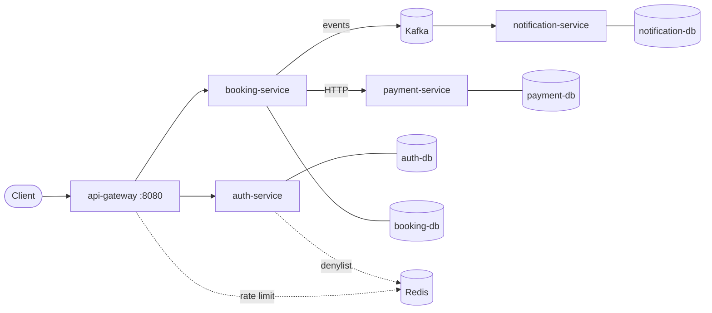

# Reservly

**English** · [Русский](README.ru.md)

A booking service for meeting rooms and coworking desks. A user picks a room and a time
slot, the system reserves it, processes the payment and confirms the booking.

The core requirement: a room cannot be booked twice for overlapping intervals. Not under
concurrent requests, and not when the payment service fails halfway through the
operation.

Two problems shape the project:

**Slot contention.** Checking availability and inserting a booking are two separate
operations, and a concurrent request fits neatly between them. Solved with pessimistic
locking at the database level.

**Distributed transaction.** The booking lives in booking-service, the payment in
payment-service, and there is no transaction spanning both. Implemented as a saga with
compensation and explicit handling of the case where no payment response arrives at all:
such a booking is neither lost nor falsely confirmed.

**Stack:** Java 21, Spring Boot 4.1, Spring Cloud Gateway, PostgreSQL 16 + Flyway, Kafka,
Redis, Docker Compose, Testcontainers.

---

## Architecture



| Service | Responsibility | Own database |
|---|---|---|
| api-gateway | Single entry point, JWT validation, routing, login rate limiting | — |
| auth-service | Registration, sign-in, token issuing and revocation | `users` |
| booking-service | Rooms, bookings, saga orchestration, reconciliation of stuck bookings | `bookings` |
| payment-service | Payments, idempotency by `booking_id` | `payments` |
| notification-service | Handling of booking events | `notifications` |

### Single entry point

Only port 8080 is published. The other services have no exposed ports and are reachable
only inside the Compose network. Calling booking-service directly to bypass token
validation is not possible from outside.

### Authentication at the edge

The gateway validates the JWT and forwards `X-User-Id` and `X-User-Role` downstream;
services trust these headers.

The upside is that services know nothing about JWT and do not parse the token five times
per request. The downside is that the trust model relies on the internal network being
unreachable except through the gateway. Beyond Compose, this spot would require either
mTLS or token validation in every service.

### Database per service

Four separate PostgreSQL instances. No service reads another service's tables — only its
API or its events.

This is where the central constraint of the system comes from: the booking and the
payment live in different databases and cannot be committed in one transaction. That is
precisely why booking confirmation is implemented as a saga rather than with
`@Transactional`.

---

## Quick start

Docker with Compose is the only prerequisite.

```bash
git clone <repo-url>
cd reservly-pet-project
make up
```

This starts five services, four PostgreSQL databases, Kafka and Redis.

Aggregated Swagger for all services: http://localhost:8080/swagger-ui.html

### Walkthrough

```bash
# 1. Sign in as the administrator
curl -X POST localhost:8080/api/auth/login \
  -H 'Content-Type: application/json' \
  -d '{"email":"admin@reservly.com","password":"admin12345"}'

# 2. Create a room — requires the ADMIN role
curl -X POST localhost:8080/api/rooms \
  -H 'Authorization: Bearer <admin accessToken>' \
  -H 'Content-Type: application/json' \
  -d '{"name":"Focus","type":"MEETING_ROOM","pricePerHour":300,"capacity":6}'

# 3. Register a regular user
curl -X POST localhost:8080/api/auth/register \
  -H 'Content-Type: application/json' \
  -d '{"email":"user@example.com","password":"password123"}'

# 4. Sign in — returns accessToken and refreshToken
curl -X POST localhost:8080/api/auth/login \
  -H 'Content-Type: application/json' \
  -d '{"email":"user@example.com","password":"password123"}'

# 5. Book a slot (substitute your token and a future date)
curl -X POST localhost:8080/api/bookings \
  -H 'Authorization: Bearer <accessToken>' \
  -H 'Content-Type: application/json' \
  -d '{"roomId":1,"startTime":"2027-01-15T10:00:00Z","endTime":"2027-01-15T11:00:00Z"}'
```

A booking is created with status `PENDING`; booking-service then calls payment-service
and moves it to `CONFIRMED` or `CANCELLED`.

Available room types: `MEETING_ROOM`, `COWORKING`.

### Roles

| Role | Can do |
|---|---|
| `USER` | Browse rooms, create and cancel their own bookings |
| `ADMIN` | The same, plus creating, updating and deleting rooms |

Registration always grants `USER`. The administrator is seeded on auth-service startup:
if no user with that email exists yet, one is created with the `ADMIN` role. The
credentials come from the `ADMIN_EMAIL` and `ADMIN_PASSWORD` variables, defaulting to
`admin@reservly.com` and `admin12345`.

### Commands

| Command | What it does |
|---|---|
| `make up` | Start everything in containers |
| `make down` | Stop |
| `make reset` | Stop, drop volumes, start again |
| `make logs S=booking-service` | Tail the logs of one service |
| `make rebuild S=booking-service` | Rebuild one service |

---

## Technical decisions

### Slot contention

The naive availability check looks like this: find overlapping bookings, and if there are
none, insert your own. There is a window between those two steps, and `@Transactional`
does not close it. The default `READ COMMITTED` isolation level lets both requests see an
empty result and insert two overlapping bookings.

The fix is a pessimistic lock on the room row taken before the check. The second request
waits on `SELECT ... FOR NO KEY UPDATE`, resumes once the first one commits, sees the
booking that is now there, and receives `409 Conflict`.

Why not optimistic locking: the conflict here is expected rather than rare — everyone
wants the meeting room at 10 a.m. on Tuesday. An optimistic scheme would push retries
onto the client.

Why not an `EXCLUDE` constraint over `tstzrange`: that solution is cleaner and enforced by
the database itself, but it is deferred — pessimistic locking was chosen as the more
explicit option in code.

The race is reproduced by
[`BookingRaceIT`](booking-service/src/test/java/com/reservly/booking/BookingRaceIT.java):
two threads start simultaneously via a `CountDownLatch`, and the test expects exactly one
`201` and one `409`, with a single row in the database.

### Booking saga

The orchestrator in booking-service drives a booking through the three possible outcomes
of the call to payment-service.

| Outcome | What happened | What the system does |
|---|---|---|
| `SUCCESS` | Payment went through | Booking → `CONFIRMED` |
| Business rejection | Payment declined | Booking → `CANCELLED`, slot released |
| **No response** | Timeout, dropped connection, service down | Booking stays `PENDING` |

The third case is the important one. A rejection and a missing response are fundamentally
different: when the connection drops, the payment may well have succeeded on the
payment-service side. Treating such a booking as failed is not acceptable — it would
allow charging the customer without granting the slot. So it stays `PENDING` and is
handed over to reconciliation.

The HTTP client to payment-service has explicit connect and read timeouts. Without them
the thread would hang until the OS timeout, turning "no response" into a stuck request.

Idempotency is enforced on the payment-service side by a unique index on `booking_id`: a
repeated call for the same booking will not create a second payment.

### Reconciliation of stuck bookings

A background job periodically picks up bookings that have been `PENDING` longer than a
threshold and asks payment-service for the actual payment status.

If a `SUCCESS` is found, the booking is confirmed. If a rejection is found, or no payment
exists at all, the booking moves to `CANCELLED`. If the service is still
unreachable, the booking waits for the next pass.

The details that matter more than the loop itself:

- `fixedDelay` rather than `fixedRate` — the next run is measured from the end of the
  previous one, so passes do not pile up when payment-service is slow.
- The transaction does not wrap the whole method. A single long transaction over the
  entire batch would hold a connection and locks for the full sweep.
- `try/catch` sits inside the loop — one problematic booking does not abort the rest.
- The query is limited to a page rather than `findAll()`.

### Authentication

A token pair: a short-lived access token and a refresh token stored in the database.
Signing out puts the access token into a Redis denylist with a TTL matching its natural
expiry, and revokes the refresh token in the database. Without a denylist, "sign out" on
stateless JWT means nothing — the token would keep working until it expired.

Login rate limiting lives in the gateway and is backed by Redis, so the counter is shared
across gateway instances instead of being per-process.

---

## Local development

Three modes, so that changing one line does not mean rebuilding an image.

**Everything in Docker** — production-like, no ports exposed:

```bash
make up
```

**Development** — the same, but the ports of all services and databases are published to
the host so a debugger or a database client can attach:

```bash
make dev
```

**One service locally** — infrastructure and the other services run in containers,
booking-service is scaled to zero (`--scale booking-service=0`) and started from the IDE:

```bash
make dev-booking
```

Configuration is arranged so that defaults target a local run (`localhost`), while
Compose overrides them with service names through environment variables. The same jar
therefore runs both in the IDE and in a container with no file edits.

---

## Testing

`BookingRaceIT` starts PostgreSQL through Testcontainers along with the application on a
random port, then reproduces a race between two concurrent bookings for the same slot.

The test is meaningful because it verifies system behaviour under contention rather than
a single method: the result is `[201, 409]` and exactly one row in the database.

As a side effect it also covers the third saga outcome — payment-service is not running
in the test environment, the call fails with `Connection refused`, and the booking
correctly stays `PENDING` instead of failing the request.

---

