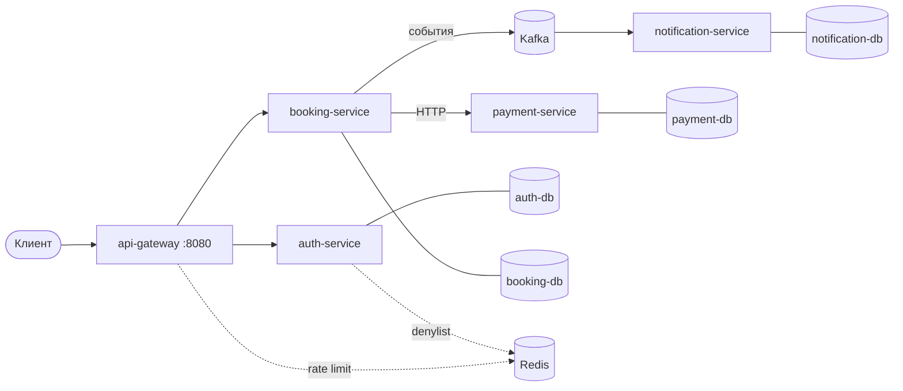

# Reservly

[English](README.md) · **Русский**

Сервис бронирования переговорных комнат и мест в коворкинге. Пользователь выбирает
комнату и интервал времени, система резервирует слот, проводит оплату и подтверждает
бронь.

Главное требование — одна комната не может быть занята дважды на пересекающийся
интервал. Ни при параллельных запросах, ни при отказе платёжного сервиса на середине
операции.

Отсюда две задачи, вокруг которых построен проект:

**Конкуренция за слот.** Проверка «свободно ли» и вставка брони — две операции, между
которыми успевает вклиниться параллельный запрос. Решено пессимистичной блокировкой
на уровне БД.

**Распределённая транзакция.** Бронь живёт в booking-service, платёж — в
payment-service, общей транзакции между ними нет. Реализована сага с компенсацией и
отдельной обработкой случая, когда ответ платежа не получен вовсе: такая бронь не
теряется и не подтверждается ложно.

**Стек:** Java 21, Spring Boot 4.1, Spring Cloud Gateway, PostgreSQL 16 + Flyway,
Kafka, Redis, Docker Compose, Testcontainers.

---

## Архитектура



| Сервис | Ответственность | Своя БД |
|---|---|---|
| api-gateway | Единственная точка входа, проверка JWT, маршрутизация, ограничение частоты логинов | — |
| auth-service | Регистрация, вход, выпуск и отзыв JWT | `users` |
| booking-service | Комнаты, брони, оркестрация саги, сверка зависших броней | `bookings` |
| payment-service | Платежи, идемпотентность по `booking_id` | `payments` |
| notification-service | Обработка событий бронирования | `notifications` |

### Одна точка входа

Наружу опубликован только порт 8080. У остальных сервисов нет проброшенных портов —
они доступны лишь внутри сети Compose. Постучаться напрямую в booking-service в обход
проверки токена снаружи невозможно.

### Аутентификация на границе

JWT проверяет шлюз. Дальше он передаёт вниз `X-User-Id` и `X-User-Role`, и сервисы
доверяют этим заголовкам.

Плюс — сервисы ничего не знают про JWT и не разбирают токен по пять раз за запрос.
Минус — модель доверия держится на том, что во внутреннюю сеть не попасть мимо шлюза.
За пределами Compose это место потребует либо mTLS, либо проверки токена на каждом
сервисе.

### База на сервис

Четыре отдельных Postgres. Ни один сервис не ходит в чужие таблицы — только через API
или события.

Отсюда следует главное ограничение всей системы: бронь и платёж лежат в разных базах,
и провести их одной транзакцией нельзя. Именно поэтому подтверждение брони реализовано
сагой, а не `@Transactional`.

---

## Быстрый старт

Нужен только Docker с Compose.

```bash
git clone <repo-url>
cd reservly-pet-project
make up
```

Поднимется пять сервисов, четыре базы Postgres, Kafka и Redis.

Swagger со всеми сервисами: http://localhost:8080/swagger-ui.html

### Сценарий

```bash
# 1. Вход администратором
curl -X POST localhost:8080/api/auth/login \
  -H 'Content-Type: application/json' \
  -d '{"email":"admin@reservly.com","password":"admin12345"}'

# 2. Создание комнаты — доступно только роли ADMIN
curl -X POST localhost:8080/api/rooms \
  -H 'Authorization: Bearer <accessToken администратора>' \
  -H 'Content-Type: application/json' \
  -d '{"name":"Focus","type":"MEETING_ROOM","pricePerHour":300,"capacity":6}'

# 3. Регистрация обычного пользователя
curl -X POST localhost:8080/api/auth/register \
  -H 'Content-Type: application/json' \
  -d '{"email":"user@example.com","password":"password123"}'

# 4. Вход — вернёт accessToken и refreshToken
curl -X POST localhost:8080/api/auth/login \
  -H 'Content-Type: application/json' \
  -d '{"email":"user@example.com","password":"password123"}'

# 5. Бронь (подставь свой токен и дату в будущем)
curl -X POST localhost:8080/api/bookings \
  -H 'Authorization: Bearer <accessToken>' \
  -H 'Content-Type: application/json' \
  -d '{"roomId":1,"startTime":"2027-01-15T10:00:00Z","endTime":"2027-01-15T11:00:00Z"}'
```

Бронь создаётся в статусе `PENDING`, затем booking-service обращается к
payment-service и переводит её в `CONFIRMED` или `CANCELLED`.

Доступные типы комнат: `MEETING_ROOM`, `COWORKING`.

### Роли

| Роль | Что может |
|---|---|
| `USER` | Просматривать комнаты, создавать и отменять свои брони |
| `ADMIN` | То же плюс создание, изменение и удаление комнат |

Регистрация всегда выдаёт `USER`. Администратор заводится сам при старте
auth-service: если пользователя с таким email ещё нет, он создаётся с ролью `ADMIN`.
Учётные данные берутся из переменных `ADMIN_EMAIL` и `ADMIN_PASSWORD`, по умолчанию
`admin@reservly.com` и `admin12345`.

### Команды

| Команда | Что делает |
|---|---|
| `make up` | Поднять всё в контейнерах |
| `make down` | Остановить |
| `make reset` | Остановить с удалением томов и поднять заново |
| `make logs S=booking-service` | Логи одного сервиса |
| `make rebuild S=booking-service` | Пересобрать один сервис |

---

## Технологические решения

### Гонка за слот

Наивная проверка занятости выглядит так: найти пересекающиеся брони, если их нет —
вставить свою. Между этими шагами есть окно, и `@Transactional` его не закрывает.
Стандартный уровень изоляции `READ COMMITTED` разрешает обоим запросам увидеть пустой
результат и вставить две пересекающиеся брони.

Решение — пессимистичная блокировка строки комнаты перед проверкой. Второй запрос
ждёт на `SELECT ... FOR NO KEY UPDATE`, дожидается коммита первого, видит уже
вставленную бронь и получает `409 Conflict`.

Почему не оптимистичная блокировка: конфликт здесь ожидаемый, а не редкий — все хотят
переговорку на 10 утра во вторник. Оптимистичный вариант заставил бы клиента
повторять запрос.

Почему не `EXCLUDE` constraint на `tstzrange`: это решение чище и держится на уровне
БД, но оно вынесено в план — пессимистичная блокировка выбрана как более наглядная в
коде.

Гонка воспроизводится тестом [`BookingRaceIT`](booking-service/src/test/java/com/reservly/booking/BookingRaceIT.java):
два потока стартуют одновременно через `CountDownLatch`, ожидается ровно один `201` и
один `409`, в базе одна запись.

### Сага бронирования

Оркестратор в booking-service ведёт бронь через три возможных исхода вызова
payment-service.

| Исход | Что произошло | Что делает система |
|---|---|---|
| `SUCCESS` | Платёж прошёл | Бронь → `CONFIRMED` |
| Бизнес-отказ | Платёж отклонён | Бронь → `CANCELLED`, слот освобождается |
| **Нет ответа** | Таймаут, обрыв, сервис недоступен | Бронь остаётся `PENDING` |

Третий случай — главный. Отказ и отсутствие ответа принципиально различаются: при
обрыве связи платёж мог пройти на стороне payment-service. Считать такую бронь
неудачной нельзя — можно списать деньги и не выдать слот. Поэтому она остаётся в
`PENDING` и передаётся сверке.

HTTP-клиент к payment-service имеет явные таймауты на соединение и чтение. Без них
поток висел бы до таймаута ОС, и «нет ответа» превращалось бы в зависший запрос.

Идемпотентность обеспечена на стороне payment-service уникальным индексом по
`booking_id`: повторный вызов для той же брони не создаст второй платёж.

### Сверка зависших броней

Фоновая задача периодически забирает брони, застрявшие в `PENDING` дольше порога, и
опрашивает payment-service о реальном статусе платежа.

Найден `SUCCESS` — бронь подтверждается. Найден отказ или платежа нет вовсе — бронь
переводится в `CANCELLED`. Сервис по-прежнему недоступен — бронь остаётся до
следующего прохода.

Детали, которые важнее самого цикла:

- `fixedDelay`, а не `fixedRate` — следующий запуск отсчитывается от конца предыдущего,
  проходы не наслаиваются при медленном payment-service.
- Транзакция не оборачивает весь метод. Одна долгая транзакция на всю пачку держала бы
  соединение и блокировки всё время обхода.
- `try/catch` внутри цикла — одна проблемная бронь не срывает обработку остальных.
- Выборка ограничена страницей, а не `findAll()`.

### Аутентификация

Пара токенов: короткоживущий access и refresh, хранящийся в БД. Выход из системы
кладёт access-токен в denylist в Redis с TTL до его естественного истечения, а
refresh-токен отзывает в базе. Без denylist «выход» на stateless JWT ничего не
означает: токен продолжал бы работать до конца срока.

Ограничение частоты логинов реализовано на шлюзе через Redis — счётчик общий для всех
экземпляров шлюза, в отличие от локального in-memory.

---

## Локальная разработка

Три режима, чтобы не пересобирать образ ради одной строки кода.

**Всё в Docker** — как в проде, порты наружу не торчат:

```bash
make up
```

**Разработка** — то же самое, но порты всех сервисов и баз проброшены на хост, чтобы
подключиться отладчиком или клиентом БД:

```bash
make dev
```

**Один сервис локально** — инфраструктура и остальные сервисы в контейнерах,
booking-service выключен (`--scale booking-service=0`) и запускается из IDE:

```bash
make dev-booking
```

Конфигурация собрана так, что значения по умолчанию рассчитаны на локальный запуск
(`localhost`), а Compose переопределяет их именами сервисов через переменные
окружения. Поэтому один и тот же jar работает и в IDE, и в контейнере без правки
файлов.

---

## Тестирование

`BookingRaceIT` поднимает PostgreSQL через Testcontainers и приложение на случайном
порту, затем воспроизводит гонку двух параллельных бронирований на один слот.

Тест содержателен тем, что проверяет не метод, а поведение системы под конкуренцией:
результат `[201, 409]` и ровно одна запись в базе.

Побочно он покрывает и третий исход саги — payment-service в тестовом окружении не
поднят, вызов падает с `Connection refused`, и бронь корректно остаётся в `PENDING`
вместо того, чтобы уронить запрос.

---

